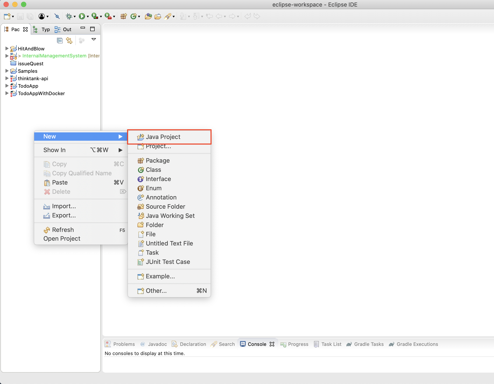
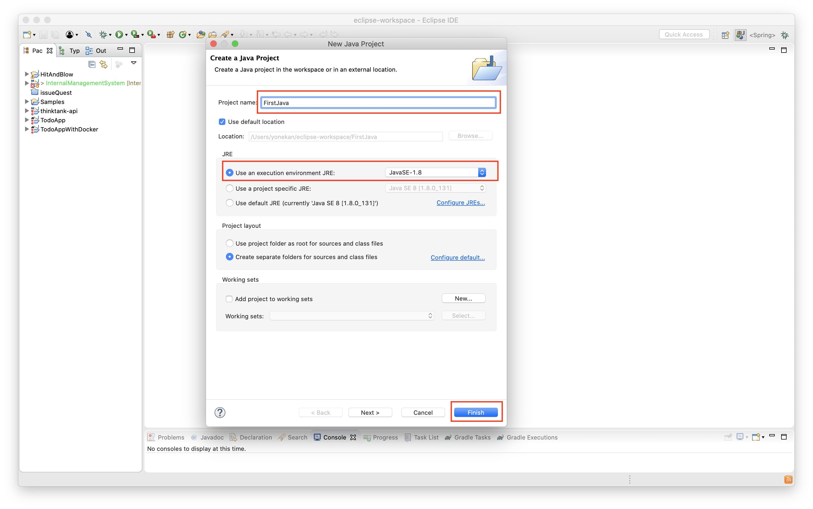
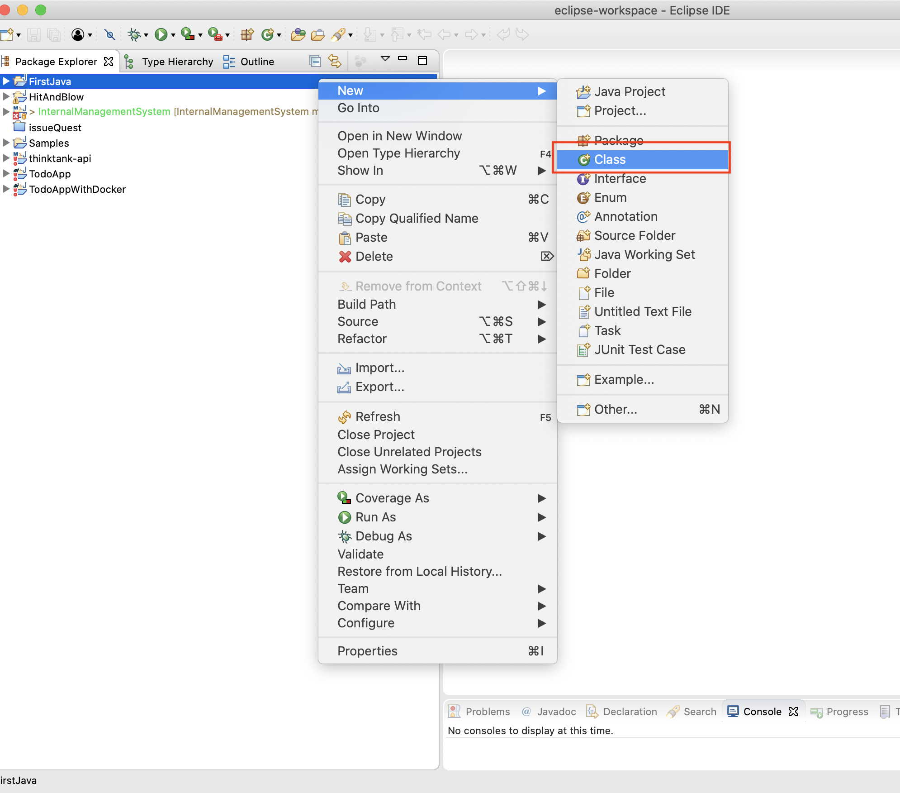
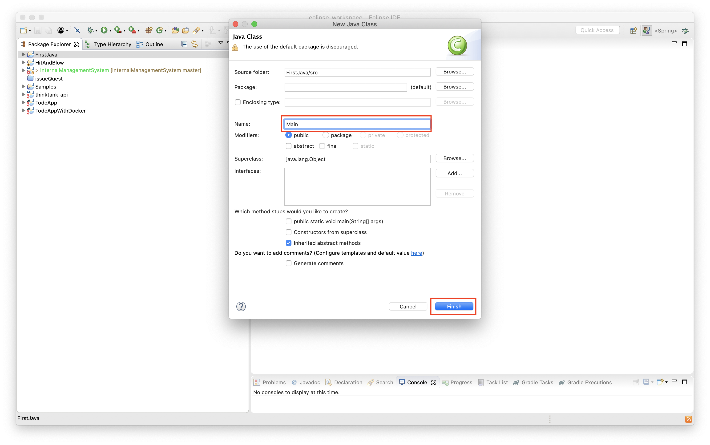
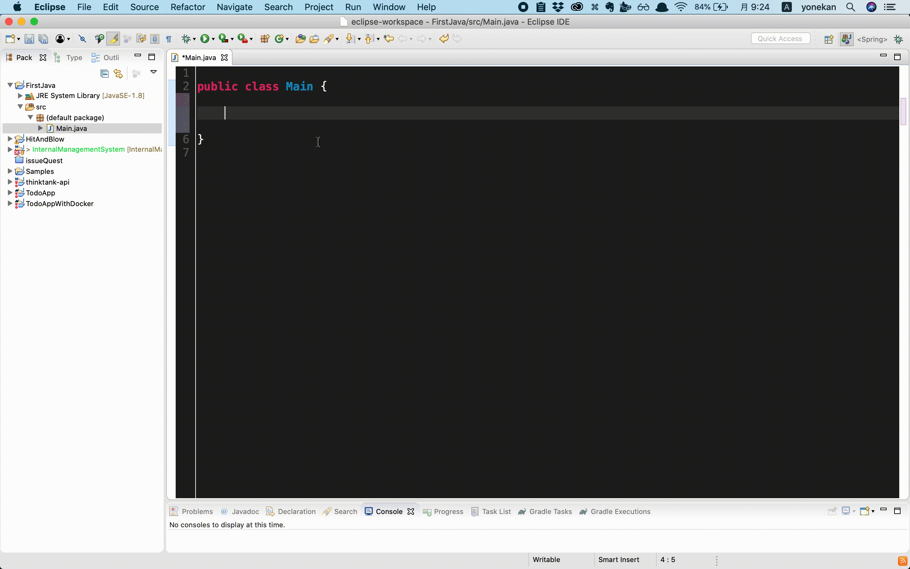
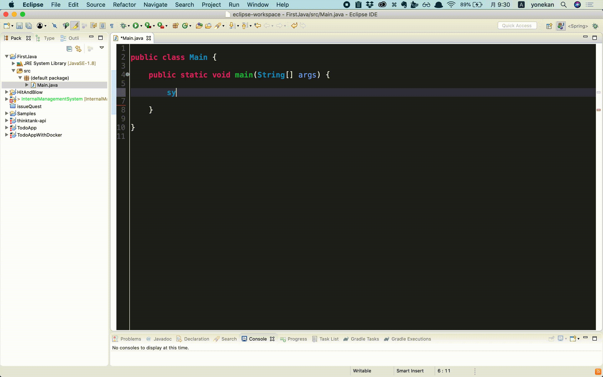

# PreLearning

## Agenda
  1. Install IDE
  2. Print 「Hello World」

### 1. Install IDE

1. For Windows User  
  [https://mergedoc.osdn.jp/pleiades-redirect/2019/pleiades_java-win-64bit_jre.zip.html?v=20191225](https://mergedoc.osdn.jp/pleiades-redirect/2019/pleiades_java-win-64bit_jre.zip.html?v=20191225)

2. For Mac User  
  [https://mergedoc.osdn.jp/pleiades-redirect/2019/pleiades_java-mac_jre.zip.html?v=20191225e](https://mergedoc.osdn.jp/pleiades-redirect/2019/pleiades_java-mac_jre.zip.html?v=20191225)

## 2. Print 「Hello World」

  1. Create New Java Project
  2. Create Class File
  3. Add main method
  4. Run code

### 2.1 Create New Java Project
  1. Right Click on Package Explorer  
    Select 「New」➞「Java Project」
      

  2. Create Project
    

### 2.2 Create Class File
  1. Right Click on Your Project  
    Select 「New」➞「Class」
      

  2. Create Class
    

### 2.3 Add Main Method
  1. Input 「main」 and 「Ctrl + Space」
    

  2. Input 「sysout」 and 「Ctrl + Space」
    