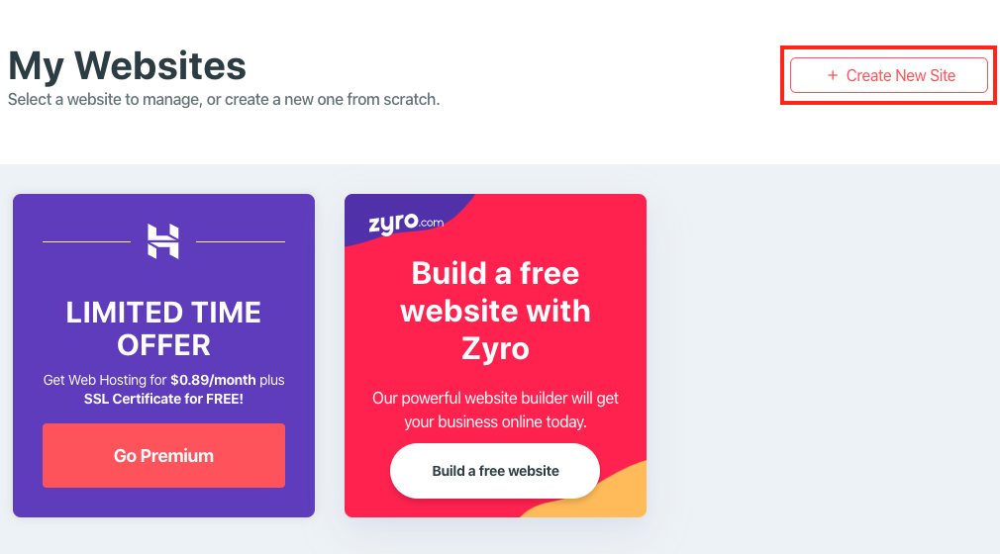

# SetUp

> We will use 000webhost.  
> This is free web hosting service

1. Access 000webhost   
https://www.000webhost.com/

2. Click 「Sign in」  
You can log in with another service or create new account

3. Webhost will ask some questions after login.  
Skip every questions by click 「Skip」

4. Click 「Create New Site」

5. Input Website name and password

6. In Management screen, click Install WordPress  
and input username and password

7. after finish install, click 「go to configuration page」  
and input username and password that you inputed